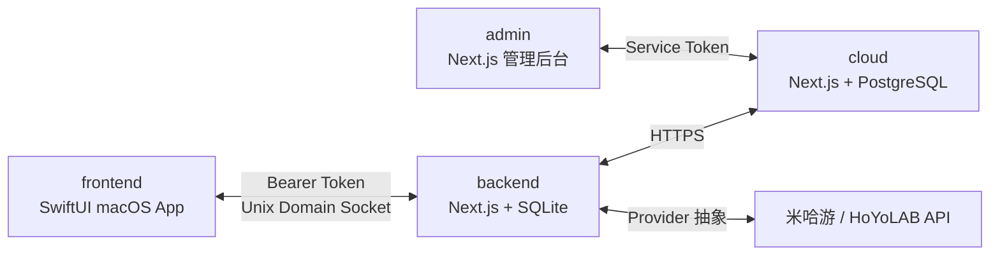

<a id="readme-top"></a>

<div align="center">
  

  <h1>MHGLauncher</h1>

  <p>面向 Apple 芯片 Mac 的《原神》国服非官方启动器与游戏数据工具。</p>

  [![质量门禁][quality-shield]][quality-url]
  [![macOS 26+][macos-shield]][macos-url]
  [![Swift 6.2][swift-shield]][swift-url]
  [![Node.js 24][node-shield]][node-url]

  [报告问题][issues-url] · [功能建议][issues-url] · [查看源码][project-url]
</div>

> **警告**
> MHGLauncher 是非官方第三方项目，与米哈游、HoYoverse 及其关联方无隶属、授权或合作关系。项目仍在开发中；兼容层运行游戏和修改游戏文件均存在账号处罚、数据损坏或运行异常的风险，请遵守游戏服务条款并提前备份重要数据。

<details>
  <summary>目录</summary>
  <ol>
    <li><a href="#about">关于项目</a></li>
    <li><a href="#features">主要功能</a></li>
    <li><a href="#architecture">项目架构</a></li>
    <li><a href="#getting-started">开始使用</a></li>
    <li><a href="#development">开发与测试</a></li>
    <li><a href="#contributing">参与贡献</a></li>
    <li><a href="#license">许可证</a></li>
    <li><a href="#acknowledgments">致谢</a></li>
  </ol>
</details>

<a id="about"></a>
## 关于项目

MHGLauncher 将原生 SwiftUI 桌面体验、游戏资源管理、Wine/DXMT 兼容层和玩家数据工具整合在一个 macOS 应用中。应用会在本机启动一个仅监听 Unix Domain Socket 的后端进程，并可按需连接自托管云端服务同步祈愿与成就数据。

项目仅支持 `arm64` 和 macOS 26，不依赖已安装的 CrossOver，也不会将闭源 CrossOver 组件打包进应用。发布构建包含本地后端；Wine、DXMT、`hpatchz` 等游戏运行组件在使用时按固定版本与 SHA-256 校验安装到 Application Support。

### 技术栈

- **桌面端：** Swift 6.2、SwiftUI、Swift Package Manager
- **本地后端：** Next.js 16、TypeScript、SQLite、Zod
- **云同步：** Next.js 16、PostgreSQL
- **管理后台：** Next.js 16、React 19、Tailwind CSS、Radix UI
- **游戏运行时：** Wine、DXMT、HDiffPatch
- **测试：** XCTest、Vitest、Playwright、GitHub Actions

<p align="right">(<a href="#readme-top">返回顶部</a>)</p>

<a id="features"></a>
## 主要功能

- 安装、更新、预下载、校验与修复《原神》国服客户端
- 通过 Wine 与 DXMT 在 Apple 芯片 Mac 上启动游戏
- 管理账号、实时便笺、角色信息、成就与消息提醒
- 同步祈愿记录，支持抽卡 URL 与 UIGF 数据导入导出
- 浏览历史卡池、祈愿统计、保底进度与五星时间线
- 将祈愿和成就数据同步至可选的自托管云端
- 通过 Keychain 保存敏感凭据，并隔离本地后端网络边界

<p align="right">(<a href="#readme-top">返回顶部</a>)</p>

<a id="architecture"></a>
## 项目架构



| 目录 | 用途 |
| --- | --- |
| `frontend/` | 原生 macOS 应用、状态管理与界面 |
| `backend/` | 本地 API、游戏安装/启动、账号与玩家数据逻辑 |
| `cloud/` | 可选的远程同步 API |
| `admin/` | 发布、用户、审计和安全管理后台 |
| `contracts/` | 前后端 API 契约 |
| `runtime/`、`packaging/` | 运行时清单、许可证与应用打包配置 |
| `scripts/` | 构建、测试、校验、发布和冒烟测试脚本 |

本地后端使用每次启动生成的 Bearer Token，并将 Unix Socket 权限设为 `0600`。测试默认可使用确定性的 fixture provider，避免依赖真实账号和外部网络。

<p align="right">(<a href="#readme-top">返回顶部</a>)</p>

<a id="getting-started"></a>
## 开始使用

### 环境要求

- Apple 芯片 Mac（`arm64`）
- macOS 26 或更高版本
- Xcode 26，包含 macOS 26 SDK 与 Swift 6.2
- Git
- Docker Desktop（仅自托管云端与管理后台需要）

构建脚本会下载并校验项目固定的 Node.js 24 工具链，无需全局安装 Node.js 或 npm。

### 本地构建并运行

```bash
git clone https://github.com/HappyDIY/MHGLauncher.git
cd MHGLauncher
./release-app.command
```

脚本会按变更范围运行测试、构建发布版并启动应用。关闭应用后，构建结果保留在 `dist/MHGLauncher.app`。

云同步是可选功能。若要连接自己的服务，可先创建本地配置：

```bash
cp .env.example .env
```

将 `MHG_CLOUD_BASE_URL` 改为有效的 HTTPS 地址；本地开发允许使用 `localhost` 或回环地址的 HTTP URL。

### 启动云端服务

```bash
cp .env.example .env
docker compose up --build
```

默认地址为：

- Cloud API：`http://localhost:3333`
- Admin：`http://localhost:3400`
- PostgreSQL：`127.0.0.1:54329`

生产部署前必须替换示例中的服务令牌、审计密钥与加密密钥，并通过 HTTPS 暴露云端 API。

<p align="right">(<a href="#readme-top">返回顶部</a>)</p>

<a id="development"></a>
## 开发与测试

```bash
# 完整质量门禁
scripts/test-all.sh

# AI/自动化改动的差异化门禁
scripts/test-ai.sh

# 单独测试各组件
scripts/test-backend.sh
scripts/test-frontend.sh
scripts/test-cloud.sh
scripts/test-admin.sh
```

修改 API 契约、共享模型或跨进程序列化格式后，还需运行：

```bash
scripts/check-api-boundary.sh
```

各组件可在对应目录使用 `npm run dev`、`npm test` 或 `swift test` 独立开发。更多约束与命令见 [`AGENTS.md`](AGENTS.md)。

<p align="right">(<a href="#readme-top">返回顶部</a>)</p>

<a id="contributing"></a>
## 参与贡献

1. Fork 本仓库并从 `main` 创建功能分支。
2. 保持 Swift 6 严格并发与 TypeScript strict mode，新增用户可见文案使用简体中文。
3. 使用简体中文 Conventional Commits，例如 `feat(backend): 实现游戏资源下载服务`。
4. 运行受影响组件的测试，并在提交前确保 `scripts/test-ai.sh` 返回 `passed`。
5. 推送分支并提交 Pull Request，说明行为变化、测试结果与潜在风险。

实现细节不明确时，请优先参考 [Snap.Hutao.Remastered][hutao-url]，并在平台差异允许的情况下保持行为一致。

<p align="right">(<a href="#readme-top">返回顶部</a>)</p>

<a id="license"></a>
## 许可证

仓库当前尚未提供根级开源许可证。在许可证明确之前，请勿将源码视为已获得复制、修改或再分发授权。第三方运行组件遵循各自许可证，详情见 [`packaging/GAME_RUNTIME_NOTICES.md`](packaging/GAME_RUNTIME_NOTICES.md)。

<a id="acknowledgments"></a>
## 致谢

- [Snap.Hutao.Remastered][hutao-url]：主要业务逻辑参考实现
- [Best README Template][template-url]：本文档的结构参考
- [YAAGL anime-game-wine][wine-url]、[DXMT][dxmt-url] 与 [HDiffPatch][hdiff-url]：游戏兼容与资源更新基础组件

<p align="right">(<a href="#readme-top">返回顶部</a>)</p>

[project-url]: https://github.com/HappyDIY/MHGLauncher
[issues-url]: https://github.com/HappyDIY/MHGLauncher/issues
[quality-shield]: https://img.shields.io/github/actions/workflow/status/HappyDIY/MHGLauncher/quality-gate.yml?branch=main&style=for-the-badge&label=%E8%B4%A8%E9%87%8F%E9%97%A8%E7%A6%81
[quality-url]: https://github.com/HappyDIY/MHGLauncher/actions/workflows/quality-gate.yml
[macos-shield]: https://img.shields.io/badge/macOS-26%2B-000000?style=for-the-badge&logo=apple
[macos-url]: https://www.apple.com/macos/
[swift-shield]: https://img.shields.io/badge/Swift-6.2-F05138?style=for-the-badge&logo=swift&logoColor=white
[swift-url]: https://www.swift.org/
[node-shield]: https://img.shields.io/badge/Node.js-24-339933?style=for-the-badge&logo=nodedotjs&logoColor=white
[node-url]: https://nodejs.org/
[hutao-url]: https://github.com/SnapHutaoRemasteringProject/Snap.Hutao.Remastered
[template-url]: https://github.com/othneildrew/Best-README-Template
[wine-url]: https://github.com/yaagl/anime-game-wine
[dxmt-url]: https://github.com/3Shain/dxmt
[hdiff-url]: https://github.com/sisong/HDiffPatch
